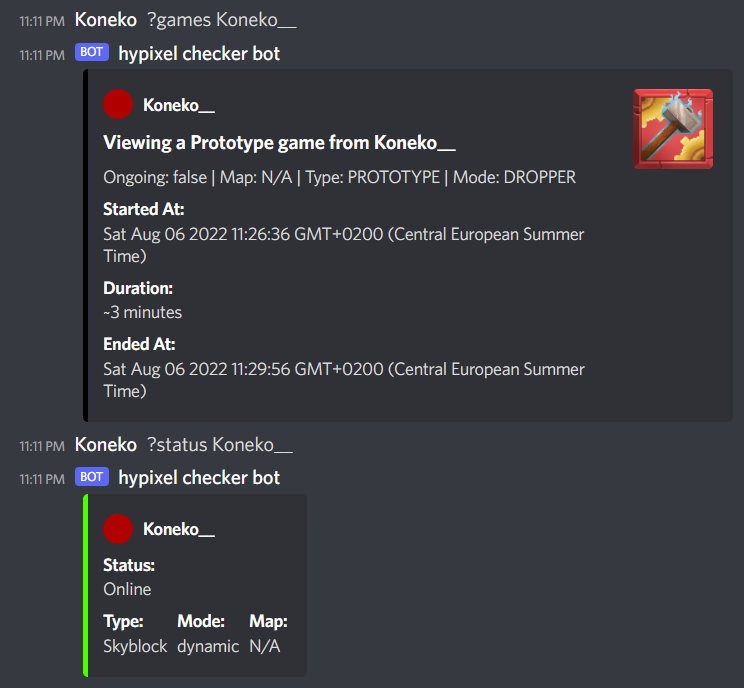

# hypixel-checker
nothing special, just a discord bot i wrote to check status and games from people on [hypixel](https://hypixel.net)  
prefix is "?" and commands are available with "?help" command  
## setup
1. create a discord bot account
2. give it perms and invite it
3. get the token from the bot
4. put it in config.json file (or env var)
5. go to play.hypixel.net and get your api key
6. put it in config.json file (or env var)
```js
    {
        "token": "BOT-TOKEN-HERE",
        "api": "API-KEY-HERE"
    }
```
7. run the bot
```
    node index.js
```
8. Profit!  

